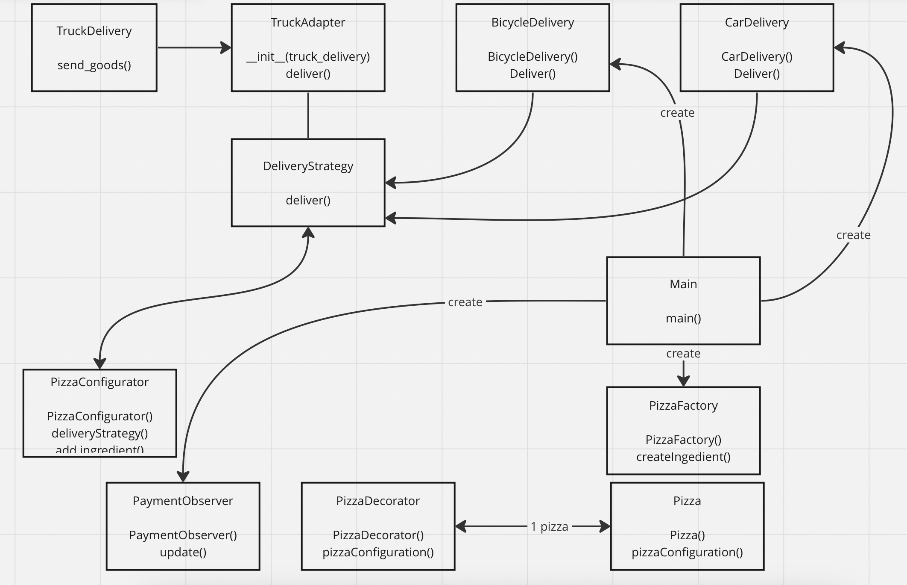

# PizzaDev: Pizza Configuration System 🍕

  

This Python project demonstrates the implementation of various design patterns to create a versatile and expandable pizza configuration system. The primary design patterns utilized include Singleton, Strategy, Factory, Decorator, Observer, and Adapter.

  

## Project Focus

  

The project focuses on building a pizza configuration system that is modular and easy to maintain by leveraging different design patterns. From managing pizza configurations to implementing dynamic delivery strategies, each pattern addresses specific concerns, contributing to the overall flexibility and scalability of the code.

  

## Purpose of the Work

  

Design Patterns Exploration: The project serves as an educational resource for understanding and implementing essential design patterns in Python.

Pizza Configuration Simulation: The code simulates a simplified pizza configuration system, demonstrating how design patterns enhance the modularity, scalability, and maintainability of the codebase.

## UML Diagram



## Objectives

  

### Singleton

The PizzaConfigurator class is implemented as a Singleton, ensuring that there is only one instance of the pizza configurator throughout the application's execution.
```
pizza_configurator = PizzaConfigurator()
```
---
### Strategy

Delivery strategies are implemented using the Strategy pattern. The PizzaConfigurator class allows users to set different delivery strategies, such as BicycleDelivery and CarDelivery, which can be executed dynamically.
```
delivery_strategy = BicycleDelivery() # or CarDelivery()
pizza_configurator.set_delivery_strategy(delivery_strategy)
```
---
### Decorator

The Decorator pattern is employed to enhance the pizza configuration process. PizzaDecorator is a base class for concrete decorators like CheeseDecorator, VegetableDecorator, and MeatDecorator.
```
extra_cheese_pizza = CheeseDecorator(pizza_configurator)
extra_vegetables_pizza = VegetableDecorator(extra_cheese_pizza)
extra_meat_pizza = MeatDecorator(extra_vegetables_pizza)
print(extra_meat_pizza.get_pizza_configuration())
```
---
### Observer

The Observer pattern is implemented for tracking the order status. OrderManager maintains a list of observers (customers) and notifies them when the status changes.
```
order_manager = OrderManager()
customer = Customer("John Doe")
order_manager.add_observer(customer)
order_manager.update_status("Order is on its way")
```
---
### Factory

The Factory pattern is used to create new instances of pizza ingredients. PizzaFactory provides a centralized way to generate different types of ingredients.
```
ingredient_factory = PizzaFactory()
cheese = ingredient_factory.create_ingredient("Cheese")
pizza_configurator.add_ingredient(cheese)
```
---
### Adapter


### Main
```
def  main():

pizza_configurator = PizzaConfigurator()

delivery_strategy =  None

payment_observer = PaymentObserver()

  

pizza_factory = PizzaFactory()

  

print("Здравствуйте, Добро пожаловать в PizzaDev. Выберите начинку для пиццы.")

print("1. Сыр 2. Ветчина 3. Курица 4. Красный лук 5. Огурчики")

ingredients_input =  input("Введите числа через пробел (например, 1 3 4): ").split()

selected_ingredients = [pizza_factory.create_ingredient(ingredient) for ingredient in ingredients_input]

  

for ingredient in selected_ingredients:

pizza_configurator.add_ingredient(ingredient)

  

print("Выберите способ доставки: 1. Велосипед 2. Автомобиль")

delivery_choice =  input("Введите 1 или 2: ")

  

if delivery_choice ==  '1':

delivery_strategy = BicycleDelivery()

elif delivery_choice ==  '2':

delivery_strategy = CarDelivery()

  

pizza_configurator.set_delivery_strategy(delivery_strategy)

print(delivery_strategy.deliver())

  

# Итог заказа

print("\n------------------------------------------")

print("\nИтог заказа:")

print(f"Ваш заказ: {pizza_configurator.get_pizza_configuration()}")

  

if delivery_strategy:

print(f"Способ доставки: {delivery_strategy.deliver()}")

print("\n------------------------------------------")

  
  

# Процесс оплаты

print("\nВыберите способ оплаты: 1. Наличными 2. Картой")

  

payment_choice =  input("Введите 1 или 2: ")

  

if payment_choice ==  '2':

while  True:

card_number =  input("Введите 12-значный номер карты: ")

if  len(card_number) ==  12  and card_number.isdigit():

break

else:

print("Ошибка! Введите корректный 12-значный номер карты.")

  

payment_observer.update("Оплата прошла успешно.")

  

if  __name__  ==  "__main__":

main()
```
---
## Usage Example

  

The main function demonstrates how to use the PizzaDev system:

1. Users select pizza ingredients by inputting numbers.
2. Users choose a delivery method (Bicycle or Car).
3. The pizza configuration and delivery details are displayed.
4. Users select a payment method (Cash or Card).
5. If Card is chosen, users input a 12-digit card number.

# Conclusion

PizzaDev demonstrates the effective use of design patterns to create a modular and extensible pizza configuration system. Whether it's customizing pizza ingredients, selecting a delivery method, or observing order status, the design patterns employed contribute to a well-organized and maintainable codebase. 🍕